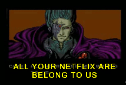

# Bad IR - *Work in Progress*
Keystroke Injection on Smart TVs

---

IR is great, and has a fair amount of applicable applications, but is controlling a networked device one of them?

The goal of this project is to execute untrusted code on a Smart TV. Using a combination of both IR and ADB commands, as well as HTTP methods, we intend to enable privileged access in order to install/side-load applications and give us a pivot into internal networks.

---

## Payload

### Remote Access

---

## Exploit Stages

### Stage 1 - Keystroke Injection via Infrared

### Stage 2 - Network Access

### Stage 3 - Payload Upload

### Stage 4 - Payload Execution

---

## Resources
### Flirc
  - https://github.com/flirc/sdk
  - https://github.com/vincebusam/flirc_retransmit

### Roku
  - https://developer.roku.com/en-gb/docs/developer-program/getting-started/developer-setup.md

